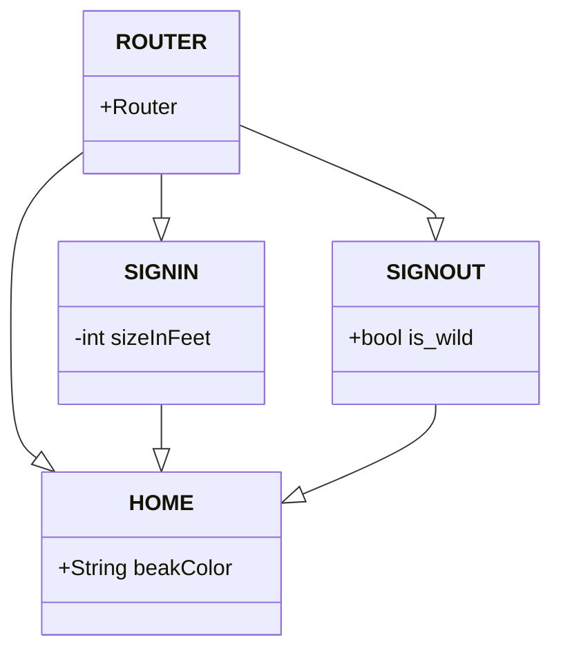

#SET PORT 4000 FOR USER

#USESELECTOR

<strong>ref</strong>[https://react-redux.js.org/api/hooks]

# SETUP ROUTER FOR HOME SIGNIN SIGNUP

```mermaid
classDiagram
      ROUTER --|> HOME
      ROUTER --|> SIGNIN
      SIGNIN --|> HOME
      SIGNOUT --|> HOME
      ROUTER --|> SIGNOUT
      ROUTER: +Router
      class HOME{
          +String beakColor
      }
      class SIGNIN{
          -int sizeInFeet
      }
      class SIGNOUT{
          +bool is_wild
      }
```
